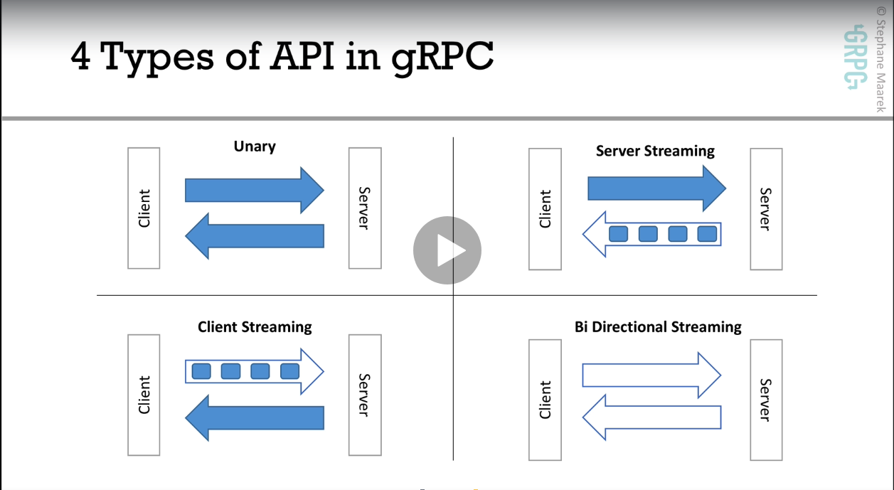
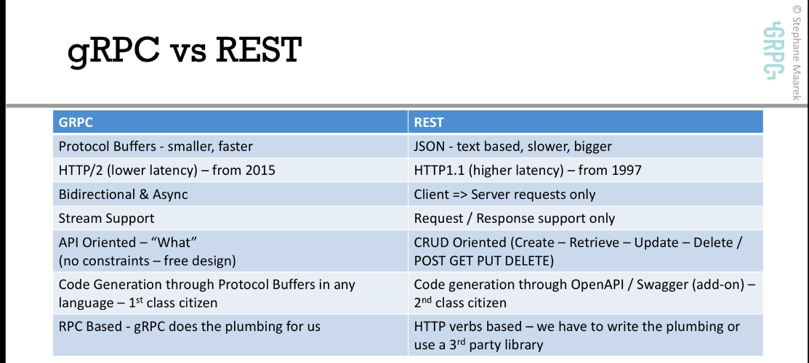

# Configuração

### Protocol Buffers

Tenha certeza que está obtendo a última versão

```
curl -OL https://github.com/google/protobuf/releases/download/v3.5.1/protoc-3.5.1-linux-x86_64.zip

unzip protoc-3.5.1-linux-x86_64.zip -d protoc3

sudo mv protoc3/bin/* /usr/local/bin/

sudo mv protoc3/include/* /usr/local/include/

sudo chown {user} /usr/local/bin/protoc

sudo chown -R {user} /usr/local/include/google
```

### Go - Protoc

```
go get -u github.com/golang/protobuf/protoc-gen-go

go get -u github.com/golang/protobuf/proto

go get -u google.golang.org/grpc
```

# Observações

## Protocol Buffers

- É agnóstico da linguagem de programação
- Dados são binários serializados (small payloads)
- Conveniente para grande troca de dados
- Permite uma fácil evolução da API
- São auto gerados stubs e skeletons à partir do arquivo .proto
- Protocol Buffers, utilizado para definir mensagens e serviços
- Protocal Buffer, define regras para evoluir a API sem quebrar os clientes já existentes

### A eficiência do Protocol Buffers em relação ao JSON / XML

- Menor payload, as mensagens são menores, economia de banda de rede
- Parsing JSON/XML exige bastante processamento, são formatos para leitura dos humanos para processamento do computador
- Protocol Buffers é um formato binários, menor processsamento
- gRPC por usar Protocol Buffers é mais rápido e com comunicação mais eficiente, bom para dispositivos com baixo poder de CPU

### HTTP/1
- Foi lançado em 1997
- Abre uma nova conexão TCP para cada requisição
- Só funciona com o modelo Request / Response (no server push)
- Header não comprimido e em texto puro
- Originalmente era composto apenas pelos os verbos GET e POST
- Atualmente qualquer página web pode carregar, em média, mais de 80 dependências que precisam ser carregadas (javascript libs, css, etc).
E para cada uma dessas requisições os header são enviados em texto puro com isso aumenta o custo de cada requisição
- Essas ineficiencias aumentam o tamanho do pacote de rede

### HTTP/2
- Foi lançado em 2015. Mas antes disso já vinha sendo testado pelo Google por alguns anos com o nome de SPDY
- Suporte a multiplexação, clientes e servidores podem enviar mensagens um ao outro em paralelo na mesca conexão TCP. Como conseguência
temos a diminuição de latência
- Suporte ao server push, servidores podem enviar stream (múltiplas mensagens) para um requesição de cliente
- Isso diminui a necessidade de round trips (latência)
- Suporte a compressão do header
- É binário

## gRPC

- É um framework gratuito e open-source desenvolvido pelo Google;
- É parte da Cloud Native Computation Foudation (CNCF) como Docker e Kubernetes, por exemplo;
- Em alto nível permite que você defina Request e Response para um RPC e manipula todo o resto para você
- Moderno, rápido e eficiente. Construído sob o protocolo HTTP/2, com baixa latência
- Suporte para streaming
- Fácil de plugar autenticação, load balancing, log e monitoração
- Resolve uma série de problemas encontrados nas antigas implementações de RPC (ex. CORBA, JAVA RMI)
- gRPC é orientado a API ao invés de orientado ao recurso como REST

Resumindo, HTTP/2 exige menos conversação, é um protocolo mais eficiente (menor consumo de banda de rede), menor latência e pode ser mais
seguro uma fez que por padrão quando usamos HTTP/2 utilizamos com SSL, mesmo não sendo obrigatório.

### Escalabilidade com gRPC - Server
- chamadas ao gRPC Server são assíncronos por padrão, isso quer dizer que não bloqueio as threads na requisição
- Cada gRPC Server podem servir milhões de requisições em paralelo

### Escalabilidade com gRPC - Client
- Podem trabalhar de forma assíncrona ou sincrona (bloqueante)
- Pode realizar um load balancing do lado cliente

### Segurança
- Por padrão gRPC fortemente recomenda o uso de SSL em sua API
- Isso significa que segurança é um cidadão de primeira classe para gRPC
- Adicionalmente usando Interceptors é possível prover autenticação

## gRPC - Tipos de API
- Unária, comunicação Cliente / Servidor no modelo Request / Response
- Server Streaming, o cliente faz uma requisição e o servidor responde com um streaming de dados
- Client Streaming, o cliente envia um streaming de dados e o servidor envia uma resposta
- Streaming bi-direcional, tanto cliente como servidor fazem a comunicação através do envio de streamings de dados

### Unary API
- Chamadas utilizando a Unary API são basicamente Request/Response conhecido por todos
- O Cliente envia uma requisição e o servidor uma resposta

### gRPC Server Streaming



## gRPC vs REST



# Material de apoio

[Material do Curso gRPC Golang Master Class](https://github.com/simplesteph/grpc-go-course)

[gRPC Web Site](https://grpc.io)
